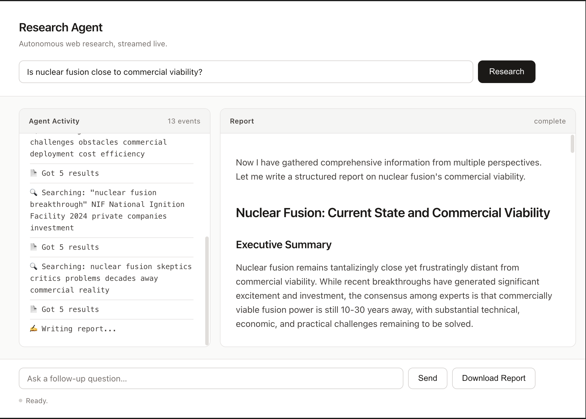

# Research Agent

An autonomous AI research agent that takes any topic, decides what to look up
on the web, runs multiple searches across different angles (facts, recent
news, expert opinions, counterarguments), and streams a structured Markdown
report back to the browser in real time.

The whole thing runs as a single FastAPI process with a dependency-free
vanilla-JS frontend — no build step, no framework lock-in.



## How it works

The agent is a classic **tool-use loop** powered by Anthropic's
`claude-sonnet-4-20250514`:

1. The browser POSTs a query to `/research` and starts reading the response
   as a Server-Sent Events (SSE) stream.
2. `agent.py` sends the query to Claude, exposing one tool: `search_web`.
3. Claude responds with a `tool_use` block. The server runs the search
   (Tavily, falling back to a DuckDuckGo scrape), formats the results, and
   replies with a `tool_result` block.
4. Steps 2–3 repeat until Claude has gathered enough information (the system
   prompt asks for at least four diverse searches).
5. Claude then returns a final assistant message containing a full Markdown
   report. The server forwards that as a `report` event, then a `done` event.

Every step the agent takes — each search query, each result count, the final
"writing report" moment — is emitted as a separate event so the UI can show
the agent's reasoning live in the left-hand activity panel.

## Setup

```bash
git clone <this-repo>
cd NightShift-Project

pip install -r requirements.txt

cp .env.example .env
# Edit .env and fill in ANTHROPIC_API_KEY (required) and TAVILY_API_KEY (recommended).

python main.py
```

Then open <http://127.0.0.1:8000> in your browser.

> The Tavily key is optional — if it's missing or fails, the agent
> automatically falls back to a DuckDuckGo HTML scrape. You only *need*
> the Anthropic key to get the app running end-to-end.

## Usage

1. Type any research topic into the search bar at the top — e.g.
   "Is nuclear fusion close to commercial viability?".
2. Click **Research**. The left panel will start filling up with live agent
   activity ("🔍 Searching: …", "📄 Got 5 results", "✍️ Writing report…").
3. The right panel streams the final Markdown report as it's produced.
4. When the run is complete, the **⬇ Download Report** button appears —
   click it to save the report as a `.md` file.
5. To ask a follow-up question on a new topic, use the input at the bottom
   of the page.

## Tech stack

| Layer    | Choice                                                              |
| -------- | ------------------------------------------------------------------- |
| Backend  | Python 3.11+, FastAPI, uvicorn, `anthropic` (async SDK)             |
| LLM      | Anthropic `claude-sonnet-4-20250514` with tool use                  |
| Search   | Tavily (`tavily-python`), with a DuckDuckGo HTML fallback via httpx |
| Streaming| Server-Sent Events over `fetch` + ReadableStream                    |
| Frontend | Single `index.html`, vanilla JS, `marked.js` from a CDN             |
| Config   | `python-dotenv` (reads `.env` at startup)                           |

## Project structure

```
.
├── main.py          # FastAPI app, SSE endpoint, static index.html serving
├── agent.py         # run_agent(): the Claude tool-use loop
├── tools.py         # search_web(): Tavily + DuckDuckGo fallback
├── index.html       # Single-page frontend (dark theme, two-column layout)
├── requirements.txt # Python dependencies
├── .env.example     # Template for required API keys
└── README.md
```

---

Built for nightshift-agi internship application.
